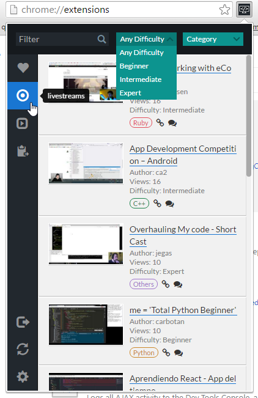
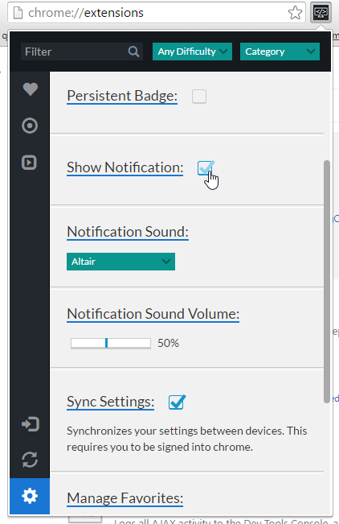

LiveCoding.tv Notifier
======================
A chrome (and possibly future firefox) extension that will display notifications when your favourite streamers on `LiveCoding.tv <https://www.LiveCoding.tv/>`_ go live! You can also browse whatever else is available to watch.

Chrome Web Store: `Link <https://chrome.google.com/webstore/detail/livecodingtv-notifier/lamnllmdnpadbhconapjiapmnpklmgbm/>`_.

Screenshots
-----------

Popup window (early version)

Options page (early version)

To-do List
----------
* Restructure and clean up CSS
* View and get reminders for scheduled streams.
* Option to turn off sync between browsers.
* Show user avatar and stream language. (currently not possible)
* Work with Firefox

License
-------
This work is licensed under the `GNU General Public License version 3 <http://www.gnu.org/licenses/gpl-3.0.en.html>`_.